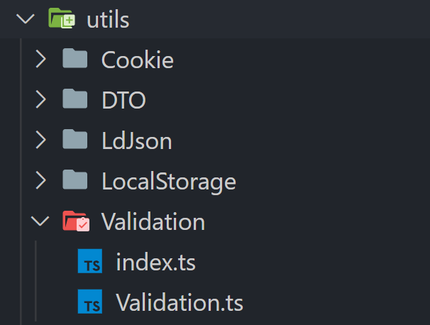

# Architecture

There are some conventions in this project that must be followed to keep the code base clean and steady

## Sections Of Content

- [Utilities](#utilities)
- [Constants](#constants)
- [Hooks](#hooks)
- [Types](#types)

## Utilities

You can find all utilities [here](../utils/). If you feel like creating a new utility, ensure that there is no utility that does something similar. If you find a utility not covering your demands completely, inherit it and create a new class or enhance an existing one. Generally, every utility has to be in OOP style

```ts
class Calculator {
  protected static SENSE_OF_LIFE = 42;
  public static PI = 3.14;

  public static printSum(a: number, b: number): number {
    return a + b;
  }
}
```

Especially pay attention that you must manually specify if method/property is public, private or protected. While creating a new utility you have to keep in mind this file convention:



1. We create a utility itself and export it as default
2. We add **index.ts** file in the same directory to export our beautiful class to the world

```ts
export { default } from "./Calculator";
```

Then this utility can be imported like so:

```ts
import Calculator from "utils/Calculator";
```

## Constants

Constants can be found [here](../constants/). This folder is intended to contain **.ts** files that export constant values like defaults. Be careful to add the only constants which are used more than once

```ts
export const CALCULATOR_MODEL_1 = "WD-220MS-BU";
export const CALCULATOR_MODEL_2 = "WD-620SH-RL";
```

## Hooks

Hooks are located [here](../hooks/). All custom hooks are contained in this folder. There is only one requirement to follow the naming convention, for instance _**use**Pagination.ts_

## Types

Can be found [here](../types/). If you as a developer find some type(s) that are used across around the code base, then it should be moved to a corresponding **.d.ts** file.
